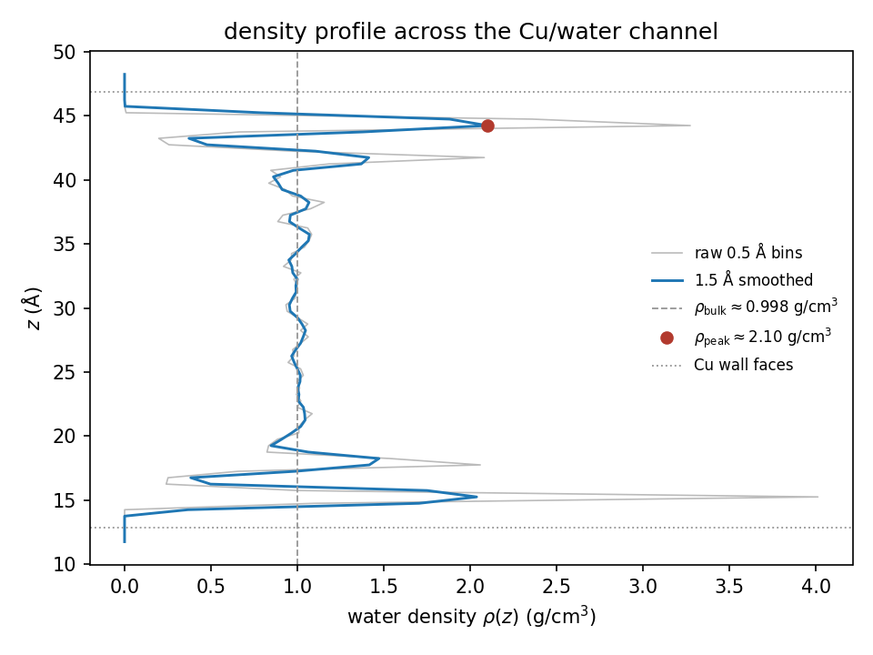
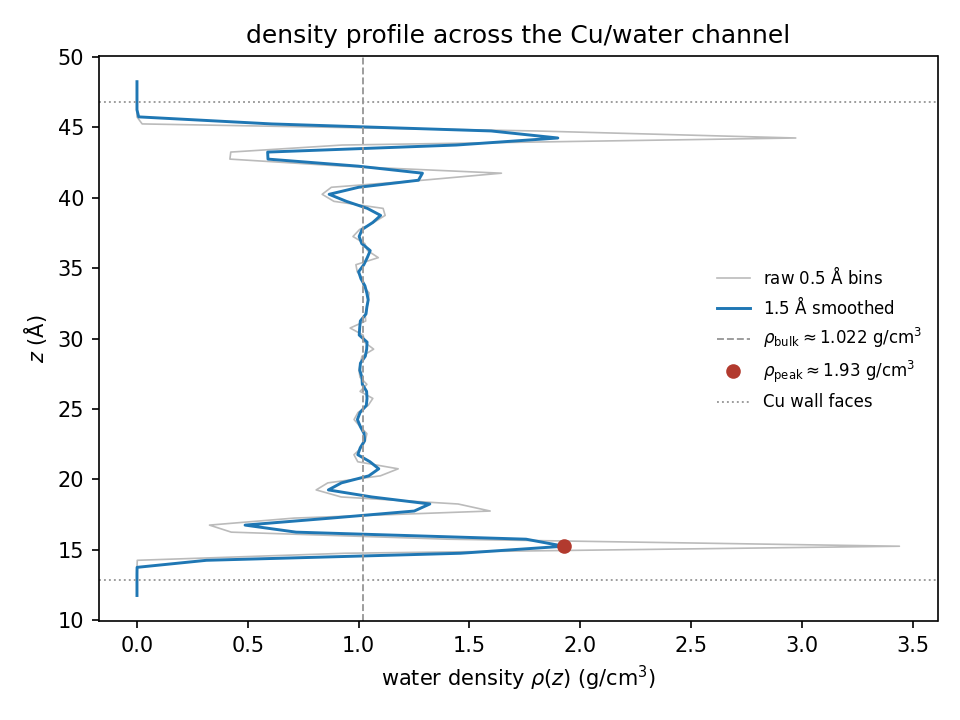
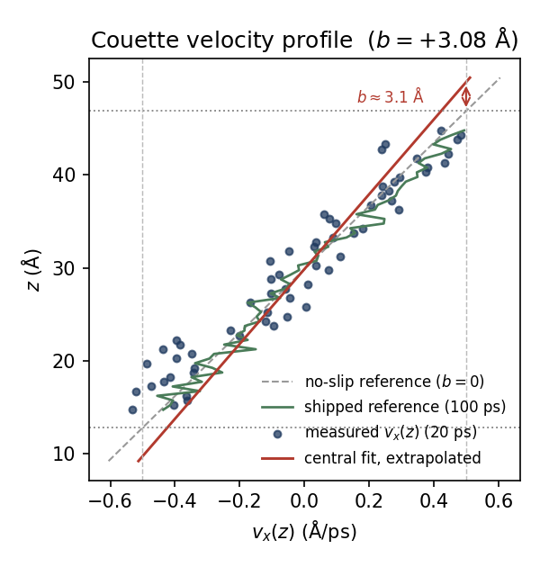
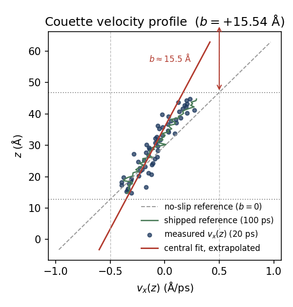
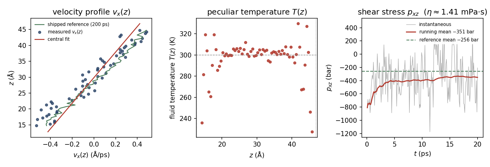
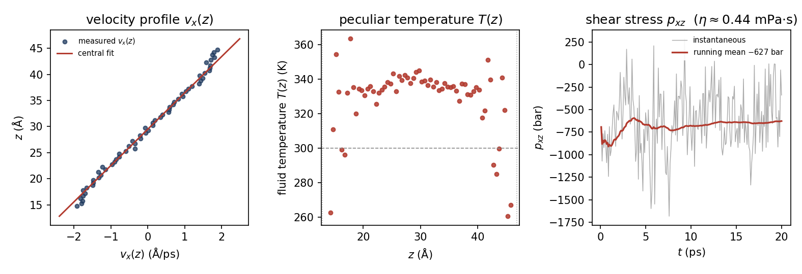
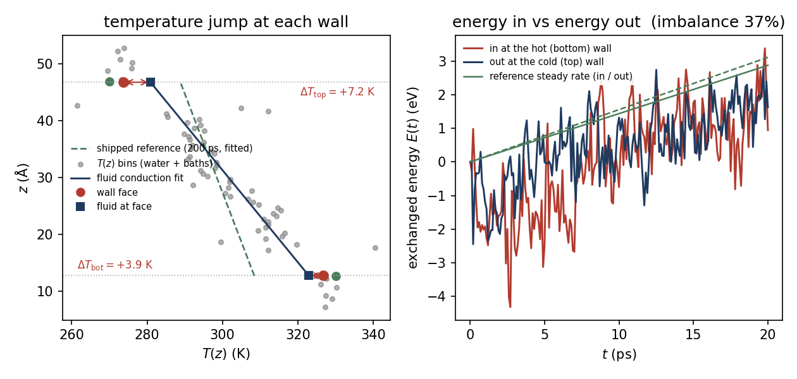
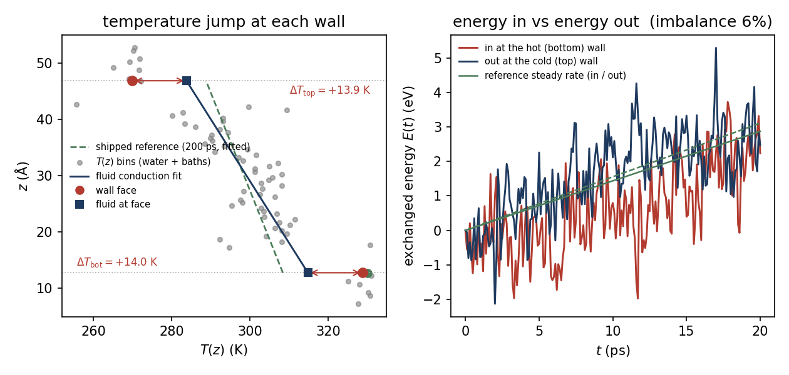

# Water between copper walls — the Day-1 stretch exercise

*One Cu/water channel, four measurements, physical units.*

On Day 1 a Lennard-Jones liquid was confined between two crystalline walls, in
reduced LJ units. This package repeats the same four measurements on water
between copper walls, in physical units: densities in g/cm³, lengths in Å,
viscosity in mPa·s, conductance in MW/m²K, temperatures in K. It is the
"water between metal walls" exercise the briefings promised, for anyone who
finishes the LJ core early or takes it as homework.

The system is a slab of TIP4P/2005 water (520 molecules) between two FCC(100)
copper walls (864 atoms), periodic in x and y, with the walls capping z. Each
wall is six (100) planes thick: the outer two planes are a rigid anchor, the
inner four are a Langevin heat bath. The water gap is about 34 Å face to face.
The force field is a standard metal/water model from the simulation literature
(see the table below); it is locked, and you do not need to edit it.

## How to run

The layout matches Day 1. Each measurement is in its own folder (`density/`,
`slip/`, `viscosity/`, `conductance/`), holding one input file and its
corresponding `analyse_<case>.py` script. Run from inside a folder:

```
cd density
lmp_serial -in density.in          # locally; on Cirrus: ../submit.sh density.in
python3 analyse_density.py
cd ..
```

Each `<case>.in` sets its case values at the top, then includes one shared
command file with a single line, `include ../shared_setup.lmp`. That file is in
the parent directory (`../`), is the same for all four cases, and reads the
pre-equilibrated channel (`data.cuw_channel`) and wires the force field, wall
roles and heat baths. You do not need to edit it. Change a measurement in one of
two ways: edit the case values at the top of the `.in` file, or pass one
`-var NAME value` on the command line.

The analysis scripts import their file-reading helpers from `lammps_io.py`, also
in the parent directory, so all four parse the LAMMPS output through the same
functions. Each script prints a short summary and saves one PNG figure.

Each run, Follow or Push, takes about 10 minutes on a single core and stays under
15 minutes. Before a local re-run, run `./clean.sh` first so the analysis script
cannot read a previous run's file. If a required output file is missing, or a
knob is set to a value with no measurement (a still wall for slip or viscosity,
equal wall temperatures for conductance), the script stops with a message naming
the flag to fix.

**Your printed values will vary.** Profile quantities (the density plateau, the
shear rate) differ by a percent or two from run to run. Values built from small
differences or from noisy stress and heat-flux averages (the slip length, the
viscosity, the interfacial jumps) can move by tens of percent. Treat signs,
trends and convergence diagnostics as more reliable than a single short-run
magnitude. Three of the four sheets ship a longer **reference** run: your
15-minute run against the converged answer.

## The three configurations

The four measurements run the same channel in one of three configurations, the
same three as Day 1:

- **A — still, isothermal** (density): both walls at 300 K, no motion.
- **B — sheared, isothermal** (slip, viscosity): the walls slide at ±`vwall`
  along x and shear the water into Couette flow, both baths at 300 K.
- **C — still, hot and cold** (conductance): the walls do not move; the bottom
  bath is held at 330 K and the top at 270 K, so heat conducts across the water.

## Force field

A standard literature metal/water force field (TIP4P/2005 water, embedded-atom
copper, Lennard-Jones cross terms). It is locked; the sheets change the knobs
listed in each section, not these parameters.

| Interaction | Style | Parameters |
|---|---|---|
| Cu–Cu | `eam/alloy` (`Cu.lammps.eam`, Sheng 2011) | embedded-atom, no free parameters |
| O–O (TIP4P/2005) | `lj/cut/tip4p/long` | ε = 0.008031034 eV, σ = 3.1589 Å |
| O–Cu | `lj/cut` | ε = `eps_sl` (default 0.0256 eV), σ = 2.751 Å |
| H–anything | `lj/cut` | ε = 0, σ = 0 (hydrogen carries charge only) |

Water is TIP4P/2005, held rigid by SHAKE: q(O) = −1.1128 e, q(H) = +0.5564 e,
r(OH) = 0.9572 Å, angle 104.52°. The walls are FCC(100) copper at lattice
constant 3.615 Å. Long-range electrostatics use `pppm/tip4p` at accuracy 1e-5
with a slab correction; the LJ and Coulomb cutoffs are 13.0 Å. The timestep is
1 fs for every measurement run.

**Small-box note.** The lateral box is 21.69 Å (6×6 Cu(100) unit cells), so the
13.0 Å cutoff is larger than half the box width (10.84 Å). LAMMPS handles this
correctly by raising the communication cutoff, so each molecule interacts with
the periodic images of its neighbours across the box. This is a teaching
compromise on a small box (the study used about 80×80 Å); the cutoff is kept at
the study's value and is not shrunk to hide it.

## How a sheet works

Each sheet is one measurement in three steps, the same as Day 1: **Follow** — run
the simulation and read the reported value; **What you should see** — what the
value is and how it is measured; **Push** — change one knob until a limit of the
measurement becomes visible.

---

## Sheet 1 — Density (knob: T)

**Goal.** Measure how strongly water layers against a copper wall. The output is
the number density profile ρ(z) across the channel: a flat bulk plateau in the
middle, oscillating layers within about 10 Å of each wall. This is the Day-1
layering measurement, now in g/cm³ against real water.

**Follow.** Configuration A, both walls at 300 K.

```
cd density
lmp_serial -in density.in
python3 analyse_density.py
```

You should see:

```
Stretch sheet 1: density
    central plateau      rho_bulk ~ 0.998 g/cm3
    first-layer peak     rho_peak ~ 2.036 g/cm3 (bottom) / 2.098 g/cm3 (top)
    contrast vs plateau  2.04x / 2.10x   (peaks within 10 A of each face: 2 / 2)
    fluid temperature    304.1 K over the 20 ps production window  (wall baths at 300 K)
    -> the water is NOT uniform: it stacks into layers against the copper wall.
```



**What you should see.** The profile is flat through the middle, at the bulk
value ρ_bulk ≈ 0.998 g/cm³ — real liquid water at ambient density. Within about
10 Å of each wall it rises into sharp peaks where the water packs into ordered
layers; the first-layer peak is about twice the bulk density. That near-wall
layering is the structure the copper imposes on the water. The figure marks
ρ_bulk and the first peak, and shows both the raw 0.5 Å bins and the 1.5 Å
smoothed profile the reported numbers use.

**Push.** Heat both walls to 450 K and re-measure at fixed volume. Because heat
enters the water only through the walls, an extra thermostat runs on the water
during equilibration only; production stays NVE.

```
lmp_serial -in density.in -var Tbot 450 -var Ttop 450
python3 analyse_density.py
```

The mid-channel water reaches about 453 K, the plateau rises to 1.022 g/cm³ (the
box volume is fixed, so hotter water cannot expand), and the first-peak/plateau
contrast drops from 2.04×/2.10× to 1.89×/1.86×. The analysis script prints an
extra line noting the walls are hotter than 300 K, so the contrast should be
compared with your 300 K run.



**Interpretation.** Heating the water thins the near-wall layers: the same wall
still orders the first contact layer, but the higher thermal motion smears the
outer oscillations, so the contrast falls. This is the same layering physics as
the Day-1 LJ channel — on Day 1 the layers were washed out by coarsening the
measurement bins; here they are washed out by heating the fluid. Either route
shows the same point: the near-wall order is a balance between wall attraction
and thermal motion.

---

## Sheet 2 — Slip length (knob: eps_sl)

**Goal.** Measure how far the water slides along the copper. The walls slide at
±`vwall` and shear the water into steady Couette flow; the velocity profile
v_x(z) is linear across the middle. Extrapolate that line into each wall: the
distance past the wall face where it would reach the wall speed is the slip
length b. This is the Day-1 slip measurement, now in Å against a copper surface.
`eps_sl` is the O–Cu attraction, the wettability knob (Day 1's ε_wf in
physical units).

**Follow.** Configuration B, wetting walls (`eps_sl` = 0.0256 eV), `vwall` = 0.5 Å/ps.

```
cd slip
lmp_serial -in slip.in
python3 analyse_slip.py
```

You should see:

```
Stretch sheet 2: slip length
    central shear rate   dvx/dz = +0.02489 (A/ps)/A   (R^2 = 0.716)
    no-slip reference    2*vwall/h = +0.02941 (A/ps)/A  (slope if the water
      stuck to the walls; slip makes the measured slope smaller)
    water temperature    302.7 K mid-channel over the 20 ps production window  (wall baths at 300 K)
    slip length          b = +3.08 +/- 2.43 A  (symmetric walls -> one b for both),
      measured to the innermost Cu plane on each side (z = 12.83 / 46.83 A).
    -> |b| <= 5 A: near no-slip - the wetting copper holds the water to
       within a few A of the stick condition.
    shipped reference (100 ps of averaging; this run: 20 ps):
      eps_sl 0.0256 eV (the wetting default): b = -1.75 +/- 0.67 A  (R^2 = 0.950)
      eps_sl 0.01 eV (the Push value): b = +5.18 +/- 1.13 A  (R^2 = 0.935)
      -> weakening the O-Cu attraction moves b by +6.9 A (5x its standard error): wettability controls slip.
```



**Reading the figure.** Height z runs up the axis and velocity v_x(z) across it, so
the plot is side-on like the channel. Four things are drawn: the **blue dots** are
your measured profile (labelled with this run's length, 20 ps); the **grey dashed**
line is the no-slip reference, the steeper profile the water would follow if it
stuck to the walls; the **red** line is the straight-line fit to the central water,
extrapolated to the wall faces, with the red arrow marking the slip length b where
it reaches the wall speed; the **green** line is the shipped 100-ps reference
profile your short run is compared against. A red fit shallower than the grey line
is positive slip; steeper (the wetting default here) is the pinned first layer, a
small negative b.

**What you should see.** The slip length b follows from the fitted central slope
s and the wall geometry. With no slip the profile would reach ±`vwall` exactly at
the innermost wall planes, spanning 2`vwall` over the face-to-face width h; the
measured profile is shallower, so it reaches ±`vwall` only a distance b beyond
each face, giving b = `vwall`/|s| − h/2. On the wetting default b is near zero
(|b| ≤ 5 Å): the copper attracts the water strongly enough to hold it close to
the stick condition. A single 20-ps run measures b to about ±2–3 Å, which is why
the sheet also ships a **reference**: your short run against a 100-ps run at both
wettabilities. The figure overlays the reference profile that matches your knobs.

**Push.** Weaken the O–Cu attraction to `eps_sl` = 0.010 eV (contact angle
104.6°, a weakly-wetting anchor).

```
lmp_serial -in slip.in -var eps_sl 0.010
python3 analyse_slip.py
```

The water now slides much further: this run reads b ≈ +15.5 Å, and the reference
tier resolves the converged separation as b(0.0256 eV) = −1.75 Å versus
b(0.010 eV) = +5.18 Å — a shift of about +6.9 Å, several times its standard
error. The script prints a line noting `eps_sl` differs from the wetting default,
so b should be compared with your default run.



**Interpretation.** Slip is set by wettability. The same O–Cu attraction that
builds the near-wall layers of Sheet 1 also controls whether the water slides:
weaken it and the water beads up and slips; keep it strong and the water wets the
copper and sticks. This is the parameter that tunes interfacial
conductance (Sheet 4), so the slip sheet and the conductance sheet turn the same
knob.

---

## Sheet 3 — Viscosity (knob: vwall)

**Goal.** Measure the shear viscosity of the confined water, η = |p_xz| / (dv_x/dz):
the shear stress over the shear rate. Same Couette geometry as Sheet 2. The shear
rate comes from the velocity profile; the shear stress p_xz comes from the
water-only virial (all contributions, not pair-only). This is the Day-1 viscosity
measurement, now in mPa·s against real water. `vwall` is the wall slide speed.

**Follow.** Configuration B, `vwall` = 0.5 Å/ps.

```
cd viscosity
lmp_serial -in viscosity.in
python3 analyse_viscosity.py
```

You should see:

```
Stretch sheet 3: viscosity
    central shear rate   dvx/dz = +0.02489 (A/ps)/A   (R^2 = 0.716)
    mean shear stress    p_xz = -350.6 +/- 43.4 bar over the 20 ps production window
    viscosity            eta = |p_xz| / (dvx/dz) = 1.41 +/- 0.24 mPa*s
    (single-run values move with the seed and the run length - compare the
     shipped reference below and the running mean in the figure.)
    water temperature    302.7 K mid-channel over the 20 ps production window  (wall baths at 300 K)
    shipped reference (200 ps of averaging; this run: 20 ps):
      eta = 0.74 +/- 0.06 mPa*s at vwall 0.5 A/ps  (R^2 = 0.984, mid-channel 301.7 K)
```



**What you should see.** The viscosity needs two numbers: one shear rate (a
straight velocity profile) and one mean shear stress. The stress is noisy over
20 ps, so a single short run reports η only to a factor of about two — this run
reads 1.41 mPa·s, well above the true value. The **reference** is a 200-ps run at
the same drive: it settles the stress average to η = 0.74 mPa·s, in the range
expected for TIP4P/2005 near 300 K (about 0.855 mPa·s at 298 K, falling with
temperature). The figure has three panels: the velocity profile with its central
fit, the peculiar temperature T(z) across the channel, and the p_xz trace with
its running mean, so you can see how far the average has settled.

**Push.** Shear four times faster, `vwall` = 2.0 Å/ps.

```
lmp_serial -in viscosity.in -var vwall 2.0
python3 analyse_viscosity.py
```

The mid-channel water rises to about 337 K, roughly 35 K above the 300 K baths,
and T(z) is visibly humped (hot centre, cool walls) in the figure. The script
prints the heating message: viscous heating has set in, the channel is no longer
isothermal, and a single η no longer describes it. The Push-window η reads about
0.44 mPa·s — lower than the Follow, because the hot centre is thinner.



**Interpretation.** Shearing the water faster heats it, and the wall baths are the
only heat-removal path, so the centre runs hottest. The velocity profile stays
straight, so η = |p_xz| / |s| still returns a number, but that number is now
averaged over a range of temperatures rather than the viscosity at one
temperature. Measure η only in the gentle, isothermal regime; the reference run
is deliberately kept at the low drive for that reason. This is the Day-1 viscous
heating story, now with a real temperature scale attached.

---

## Sheet 4 — Interfacial conductance (knob: nequil)

**Goal.** Measure how well heat crosses the Cu/water interface. Hold the bottom
wall hot (330 K) and the top wall cold (270 K); heat conducts across the water,
and the temperature profile T(z) shows a sharp jump ΔT right at each interface
(the Kapitza resistance). The interfacial conductance is G = J / ΔT, with J the
heat flux from the wall baths. This is the Day-1 conductance measurement, now in
MW/m²K against real water on copper. `nequil` is the number of equilibration
steps.

**Follow.** Configuration C. The gradient is built into the input file, so the
base run needs no flags.

```
cd conductance
lmp_serial -in conductance.in
python3 analyse_conductance.py
```

You should see:

```
Stretch sheet 4: interfacial conductance
    wall baths           Tbot = 330 K / Ttop = 270 K   (the bottom wall is hot)
    energy in / out      in +0.196 +/- 0.255 eV/ps at the bottom wall,
                         out +0.135 +/- 0.267 eV/ps at the top wall
    imbalance            36.9 %   (energy in equals energy out in a steady run)
      -> the two tallies have not converged - this run is shorter than the
         steady-state time. The jumps below are a snapshot of the transient,
         not the steady answer.
    conduction fit       dT/dz = -1.235 K/A across the fluid interior (R^2 = 0.596;
                         the adhered first 4 A of water at each face excluded)
    temperature jumps    dT_bot = +3.9 +/- 2.9 K, dT_top = +7.2 +/- 3.0 K
      (a jump that does not clear 3x its fit error is not resolved: G = J / dT
       there would divide by noise, so it is not quoted for this window)
    water temperature    300.6 K at mid-channel over the 20 ps production window
    shipped reference (200 ps of averaging after 150 ps of settling; this run: 20 ps):
      energy in / out = +0.144 / +0.155 eV/ps  (imbalance 7.9 %)
      dT_bot = +21.6 +/- 3.0 K, dT_top = +18.8 +/- 3.0 K
      G_bot = 226 +/- 64 MW/m2K, G_top = 281 +/- 55 MW/m2K   (G = J / dT per wall)
```



**What you should see.** At each wall the water does not quite reach the wall
temperature: T(z) jumps at the interface, and G = J / ΔT measures how easily heat
crosses it. Real water reaches its steady thermal profile slowly, so a 15-minute
run shows only the transient and **cannot measure G**. Two things say so. The two
bath tallies disagree by 37 % (in a steady run, energy in equals energy out), and
the interfacial jumps this run reports (+3.9 and +7.2 K) do not clear three times
their fit error, so they are not resolved. The jumps and G the sheet quotes come
from the **reference** alone: a 200-ps run after 150 ps of settling, which reaches
8 % imbalance, resolved jumps of about +20 K, and G ≈ 226 and 281 MW/m²K at the
two walls. That two-tier split is the honest lesson: at real-water scales steady
state is expensive, so a student-length run shows the transient and the shipped
reference shows the converged answer.

**Push.** Cut the equilibration to a quarter, `nequil` = 3000 (from 12000).

```
lmp_serial -in conductance.in -var nequil 3000
python3 analyse_conductance.py
```

The run is even further from steady state, but this shows up differently from
Day 1. At 20 ps of production the imbalance a single run reports is dominated by
seed noise: it swings across the whole range from run to run, so this Push run
happens to read a low imbalance (about 6 %), below the Follow's 37 %, rather than
above it. The interfacial jumps clear their fit error here (+14.0 and +13.9 K), so
the script prints its second caveat: both jumps are resolved, but a
student-length run is still transient, so its G = J / ΔT is a snapshot, not the
measured conductance — which is quoted from the reference.



**Interpretation.** A single student-length imbalance is not a reliable steady-state
diagnostic on real water: even the converged reference, sliced into 20-ps windows,
swings the imbalance from a few percent to over 100 %. So neither the Follow nor
the Push measures G — which is exactly why the reference tier exists. On Day 1 the
LJ system reached steady state fast enough that cutting the equilibration cleanly
diverged the two heat tallies; here, at real-water time scales, the transient and
the noise are large in both runs, and the trustworthy number comes from the long
reference. The interface itself is the point: heat meets a resistance crossing the
solid–liquid boundary, and that resistance is what `eps_sl` tunes — the same
knob you changed in Sheet 2.

---

## Knobs

Every knob below has a default; change one at a time with `-var NAME value`. The
defaults are the values set in each `<case>.in`; `-var` overrides them.

| Knob | Default | Sheets | Meaning |
|---|---|---|---|
| `Tbot` / `Ttop` | 300 / 300 K | all (conductance: 330 / 270) | wall bath temperatures; the density Push raises both |
| `eps_sl` | 0.0256 eV | slip, viscosity | O–Cu LJ ε (wettability); the slip Push drops it to 0.010 |
| `vwall` | 0.5 Å/ps (0.0 still) | slip, viscosity | wall slide speed; the viscosity Push raises it to 2.0 |
| `nequil` / `nprod` | 10000 / 20000 | all (conductance: 12000 / 20000) | equilibration / production steps at 1 fs; the conductance Push quarters `nequil` to 3000 |
| `binw` | 0.5 Å | all | profile bin width |
| `delta` | 1.45 Å | viscosity | depletion-layer thickness for the stress volume |
| `seed` | 90187 | all | random seed |
| `dt` | 0.001 ps | all | timestep (1 fs) |
| `dump` | 0 | all | `-var dump 1` also writes `cuw_traj.xyz` (VMD/OVITO) |

## Notes

- **The wall baths thermostat the thermal motion, not the flow.** On the sheared
  sheets (slip, viscosity) the Langevin baths act on the y and z velocities only,
  so damping the temperature does not directly damp the Couette flow you drive
  along x. A bath that thermostatted the full velocity would pump heat into the
  fluid even at zero drive; this one does not.
- **Re-running a sheet locally.** `submit.sh` clears old output before each Cirrus
  job, but a direct `lmp_serial` run does not; run `./clean.sh` first so the
  analysis script cannot read a previous run's file. `clean.sh` does not touch the
  source files, the shipped inputs (`data.cuw_channel`, `Cu.lammps.eam`), or the
  `reference/` folders.
- **Reference runs.** The `slip/`, `viscosity/` and `conductance/` folders each
  ship a `reference/` folder holding a longer run of the same input file; its
  `README` records the exact command, length and seed. The analysis scripts read
  it automatically and overlay it on the figure.
